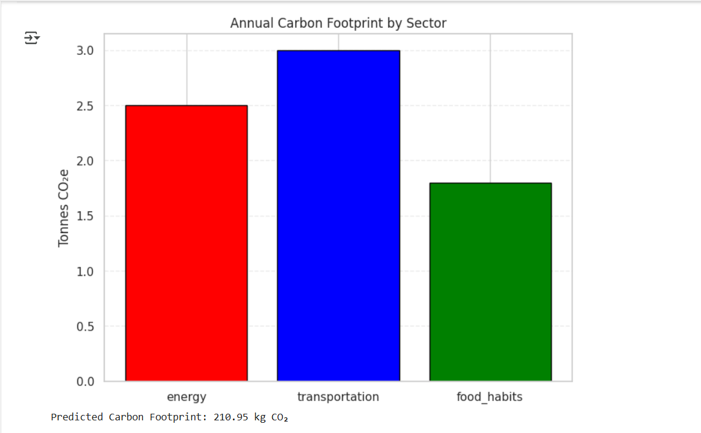

# 🌍 Carbon-Footprint-Calculator-Using-AI :
                      -This AI-powered Carbon Footprint Calculator estimates an individual's or organization's carbon emissions based on lifestyle, energy use, transportation, and consumption habits. It uses machine                         learning models to provide accurate, personalized insights and recommendations to help reduce carbon footprints.

# 🚀 Features :
            -🧠 AI-powered estimation based on user habits and location
            -🌱 Personalized tips to reduce carbon emissions
            -🚗 Transportation and travel emission analysis
            -🏠 Home energy use breakdown
            -📊 Visual dashboards for emissions tracking
            -📈 Data-driven predictions and comparisons

# ⚙️ Tools and Technology used :
                        -Python
                        -Pandas
                        -NumPy
                        -TensorFlow
                        -Google Colab
                        -Matplotlib

# 💡 Output :

# 🙌 Contribution :
                  -Mr. Nagraju Jakkula
                  -Mr. Rohan Fande
                  -Mr. Vaibhav Jawade
                  -Mr. Rushikesh Ambore
                  -Mr. Rahul Naktode
